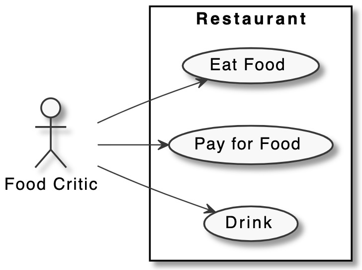

# Analysis

---

# Contents
1. [User Stories](#UserStories)
2. [Use Cases](#UseCases) 
	2.1 [Use Case Diagram](#UseCaseDiagram)
3. [Test Scenarios](#TestScenario)
4. [Data Dictionary](#DataDictionary)
5. [Project Charter](#ProjectCharter)
6. [Work Breakdown Structure](#WBS)

## User Stories

---
## Use Cases

### Use Case Diagram

---

## Test Scenario

---

## Data Dictionary

---

## Project Charter

---

## Work Breakdown Structure

---
