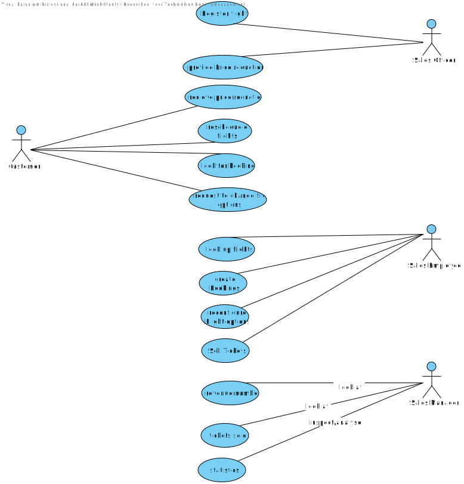
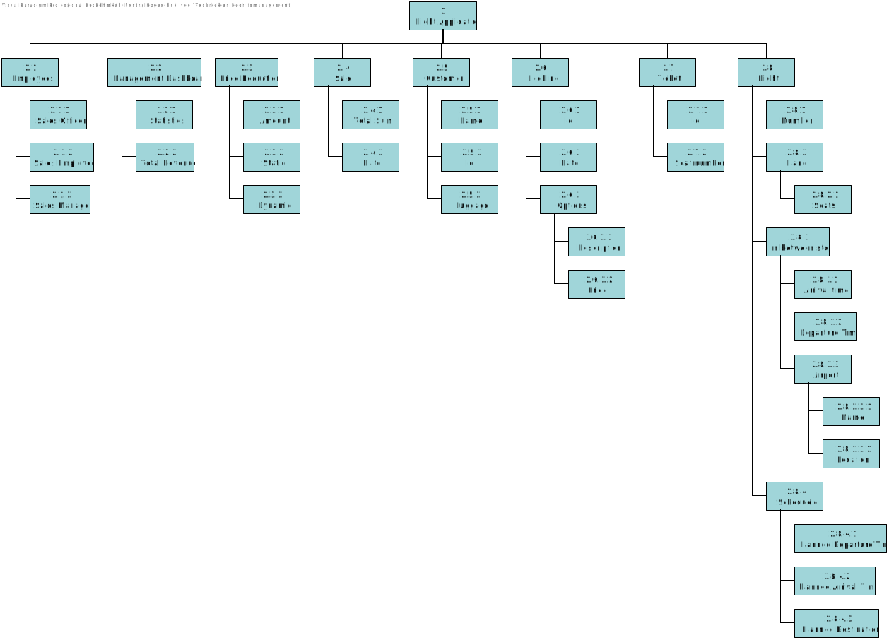

# Analysis

---

# Contents
1. [User Stories](#UserStories)
2. [Use Cases](#UseCases) 
	2.1 [Use Case Diagram](#UseCaseDiagram)
3. [Domain Model](#DomainModel)
4. [Test Scenarios](#TestScenario)
5. [Data Dictionary](#DataDictionary)
6. [Project Charter](#ProjectCharter)
7. [Work Breakdown Structure](#WBS)

---
 
## User Stories
>The link below brings you to the User Stories file
  
[User Stories](https://github.com/FontysVenlo/prj2-2021-prj2-2021-12/blob/master/analysis/UserStories/User%20Stories.md)

---
 

## Use Cases
>The link below brings you to the Use Cases file
  
[Use Cases](https://github.com/FontysVenlo/prj2-2021-prj2-2021-12/blob/master/analysis/UseCase/usecases.md)

>---

### Use Case Diagram

---
 

## Domain Model

---
 

## Test Scenario
>The link below brings you to the Test Scenario file
  
[Test Scenario](https://github.com/FontysVenlo/prj2-2021-prj2-2021-12/blob/master/analysis/testscenarios.md)

---
 

## Data Dictionary
>The link below brings you to the Data Dictionary file
  
[Data Dictionary](https://github.com/FontysVenlo/prj2-2021-prj2-2021-12/blob/master/analysis/DataDictionary/Data%20Dictionary.md)

---
 

## Project Charter
>The link below brings you to the Project Charter file
  
[Project Charter](ProjectChartWBS/Project%20Charter.pdf)

---
 

## Work Breakdown Structure

---
 
