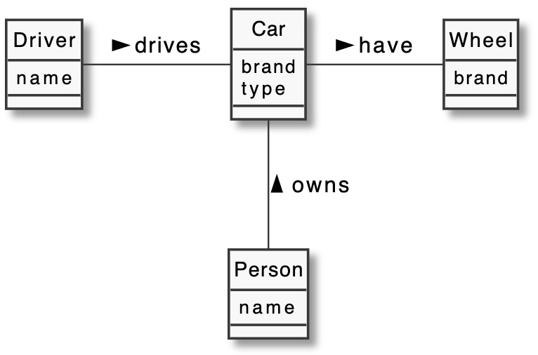

# Analysis

---

# Contents
1. [User Stories](#UserStories) 
2. [Use Cases]() 
		2.1 [Use Case Diagram]() 
3. [Test Scenarios]()
4. 
5. 
Put in here all analysis artefacts and documentation.

> Below are only examples! You can also use Visual Paradigm Models. Remove this and this text. 

## User Stories

## Use Cases

